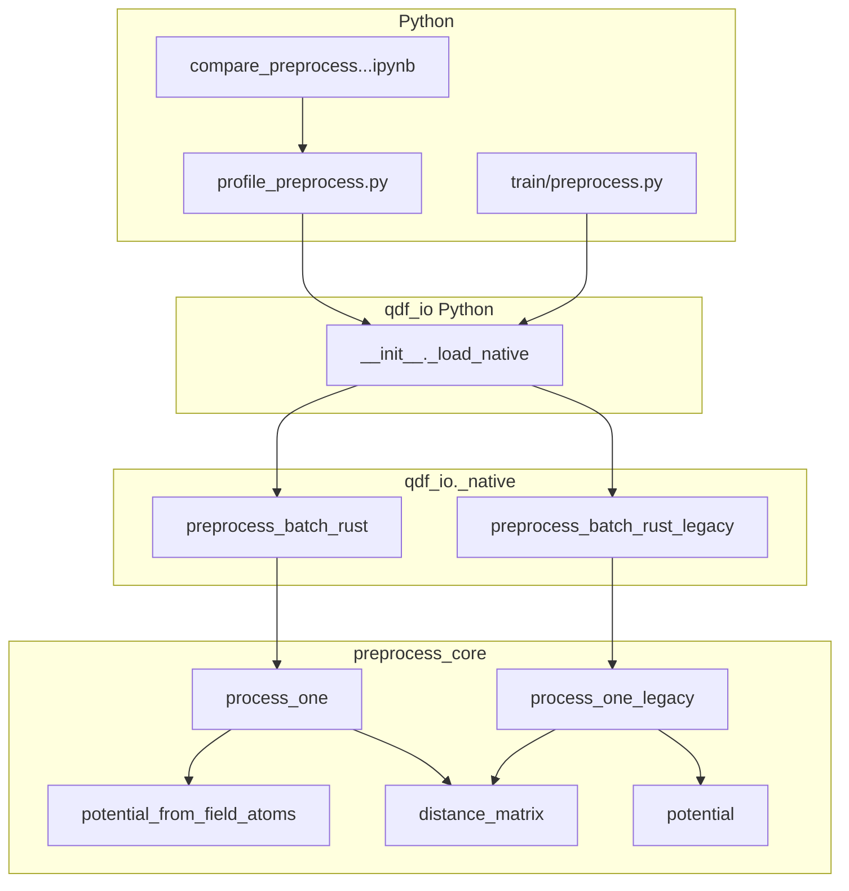

# Design: QDF 전처리 Rust 최적화·레거시 경로·벤치마크 노트북

**상태:** 구현 완료  
**범위:** `qdf_io`, `bench/profile_preprocess.py`, `qdf_io` Python 로더, 벤치 노트북  
**관련 이슈:** 원자–격자 거리행렬은 포텐셜에만 쓰이고 저장되지 않음 → 할당 제거 가능

---

## 1. 배경과 문제 정의

### 1.1 기존 파이프라인

`train/preprocess.py` 및 `bench/profile_preprocess.py`의 NumPy 경로는 대략 다음 순서입니다.

1. `create_sphere` → 격자 스텐실 (한 번)
2. `_parse_molecule_block` → 텍스트 블록 파싱
3. `create_field` → 분자별 필드 좌표
4. `create_distancematrix(field, atoms)` → **원자–필드 거리행렬** (저장 안 함, 포텐셜만)
5. `create_potential` → 가우시안 외포텐셜
6. `create_distancematrix(field, orbitals)` → **궤도–필드 거리행렬** (저장)
7. `np.save` 등

Rust 경로(`preprocess_batch_rust`)는 동일 수치 계약을 맞추되, Rayon으로 분자 배치를 병렬 처리합니다.

### 1.2 병목

프로파일 기준으로 NumPy에서는 `distmat_orbitals` 비중이 크고, Rust에서는 `rust_preprocess_batch`와 Python `parse_molecule` 비중이 큽니다.  
Rust 쪽에서 **원자–필드 거리행렬 전체를 재료화**하는 단계는 포텐셜 한 번에만 쓰이므로, 메모리 대역폭과 캐시 측면에서 제거 여지가 있습니다.

---

## 2. 목표

| ID | 목표 |
|----|------|
| G1 | 기존 NumPy/SciPy·Rust 출력과 **수치적으로 동등**한 Rust 핫패스 유지 |
| G2 | **원자–필드 거리행렬 할당/기록/재스캔** 제거로 `process_one` 비용 감소 |
| G3 | “최적화 전 Rust”와의 **공정 A/B**를 위해 동일 API로 **레거시 경로** 보존 |
| G4 | Windows에서 **오래된 `_native*.pyd`**와 최신 Rust 빌드 불일치 시에도 동작·안내 |
| G5 | **Python / Rust(legacy) / Rust(최적)** 벤치 및 시각화를 한 노트북에서 재현 |

비목표(이번 설계 범위 밖):

- `_parse_molecule_block` Rust 이전
- 궤도–필드 `distance_matrix` SIMD/블록화 (후속 가능)
- `train/preprocess.py` 기본 동작 변경(기본은 기존과 동일, `rust-legacy`는 벤치 전용)

---

## 3. 아키텍처 개요

---

## 4. Rust 설계 (`qdf_io/src/lib.rs`)

### 4.1 모듈 `preprocess_core`

| 심볼 | 역할 |
|------|------|
| `distance_matrix` | (n1,3)×(n2,3) 유클리드 거리, 0 → `1e6` (Python `create_distancematrix`와 동일) |
| `potential` | `exp(-d²)` 가우시안과 원자번호 가중 합 → **단위 테스트·레거시에서 사용** |
| `potential_from_field_atoms` | **신규.** `field`, `atomic_coords`, `atomic_numbers`만으로 위 `potential`과 동일 수치. 원자–필드 **행렬 미생성** |
| `create_field` | 기존과 동일 |
| `process_one` | **변경:** `create_field` → `potential_from_field_atoms` → `distance_matrix(field, orbitals)` |
| `process_one_legacy` | **추가:** 예전 경로 `create_field` → `distance_matrix(field,atoms)` → `potential(dm)` → `distance_matrix(field,orbitals)` |

### 4.2 수치 계약

- 중간은 **f64** (기존 NumPy/SciPy 관행과 맞춤), 출력은 **f32** (`to_f32`).
- `potential_from_field_atoms`에서 `d == 0` 분기는 기존과 같이 `exp(-(1e6)²)`에 해당하는 무시 가능 기여로 처리.

### 4.3 PyO3 API

| 함수 | 설명 |
|------|------|
| `preprocess_batch_rust` | 기존과 동일 이름. 내부에서 `process_one` 사용 |
| `preprocess_batch_rust_legacy` | **추가.** 동일 시그니처, `process_one_legacy` 사용. 벤치·회귀 비교 전용 |

Rayon: 입력을 `to_owned()`로 `Array2`에 모은 뒤 `py.allow_threads` 안에서 `par_iter` — 기존과 동일 패턴.

### 4.4 테스트 (`#[cfg(test)]`)

1. `potential_from_field_atoms` vs `distance_matrix` + `potential` 일치 (`1e-12`)
2. `process_one` vs `process_one_legacy` — `dm_orbital`, `potential` f32 허용 오차 내 일치

---

## 5. Python 로더 설계 (`qdf_io/python/qdf_io/__init__.py`)

### 5.1 문제

- Jupyter가 잡고 있는 **`_native*.pyd`**가 오래된 경우, 새 심볼 `preprocess_batch_rust_legacy`가 없어 **AttributeError** 발생 가능.
- `maturin develop`이 **다른 가상환경**의 인터프리터를 고르면, 사용자가 쓰는 venv의 `.pyd`는 갱신되지 않을 수 있음.

### 5.2 정책

1. 패키지 내 `from . import _native` 성공 + `ShardWriter` 존재 시:
   - `preprocess_batch_rust_legacy` **속성이 있으면** 그대로 사용.
   - **없으면** `sys.modules`에서 제거 후 `fresh_native_sidecar_path`, `target/release/qdf_io.dll`, `target/maturin/qdf_io.dll` 순으로 `importlib` 로드 시도.
   - DLL에서 legacy를 찾으면 그 모듈 반환.
   - 실패 시 패키지 `_native` 재import (legacy 없을 수 있음 → `getattr(..., None)`).
2. `preprocess_batch_rust_legacy = getattr(_mod, "preprocess_batch_rust_legacy", None)` 로 **import 단계 예외 방지**.
3. `profile_preprocess.py`의 `rust-legacy`는 `None`이면 **명시적 종료 메시지**(재빌드·같은 `python.exe`·DLL 폴백 안내).

---

## 6. `profile_preprocess.py` 설계

### 6.1 `--backend` 값

| 값 | 동작 |
|----|------|
| `numpy` | 기존 SciPy 경로 |
| `rust` | `qdf_io.preprocess_batch_rust` |
| `rust-legacy` | `qdf_io.preprocess_batch_rust_legacy` |

### 6.2 공통 루프

- `parse_molecule`는 모든 백엔드에서 동일 (`_parse_molecule_block`).
- Rust 계열은 배치 버퍼 → `rust_pack_inputs` → 네이티브 배치 → `assemble` (+ 선택 `np_save`).

### 6.3 타이밍 키

- 레거시/최적 모두 동일 버킷명 `rust_preprocess_batch`에 누적(서브프로세스별로 한 세트만有意).

---

## 7. 노트북 설계 (`bench/compare_preprocess_python_rust_before_after.ipynb`)

### 7.1 목적

동일 `LIMIT`·데이터셋으로 **세 구성**의 `profile_preprocess.py` stdout을 파싱해 표·그래프로 비교.

### 7.2 구성 요소

| 요소 | 설명 |
|------|------|
| `find_repo_root()` | CWD에서 `QuantumDeepField_molecule/bench/profile_preprocess.py` 탐색 |
| `parse_profile_preprocess` | `wall time`, `molecules`, `name : X.XXX s (` 패턴 파싱 |
| `run_profile_preprocess` | `subprocess.run` + 실패 시 로그 |
| `RUN_LEGACY` | `False` 시 **Python + Rust(최적)** 만 실행 → subprocess·SciPy cold start 감소 |
| `ensure_qdf_io_supports_rust_legacy` | `RUN_LEGACY`일 때만 호출 |
| 출력 | 각 run: **script wall** vs **subprocess elapsed**; 전체 driver 합계 |

### 7.3 시각화

1. **전체 wall** 막대 (백엔드별).
2. **Rust만** `rust_preprocess_batch` 합계(레거시 실행 시 비교).
3. **단계별:** 백엔드당 가로 막대(양수 step만); 단계 union에 대한 **그룹 세로 막대** 비교.

### 7.4 “노트북이 느려진 것처럼 보이는” 이유 (문서화)

- **subprocess마다** Python 인터프리터·SciPy 등 **콜드 import** 비용이 `wall time`에 포함되지 않음.
- 세 번 연속 실행 시 **경과 시간 합**은 커지나, **스크립트 내부 wall 합**은 그보다 작을 수 있음.

---

## 8. 파일 변경 목록

| 경로 | 변경 요약 |
|------|-----------|
| `QuantumDeepField_molecule/qdf_io/src/lib.rs` | `potential_from_field_atoms`, `process_one` 수정, `process_one_legacy`, `preprocess_batch_rust_legacy`, 테스트, `pymodule` 등록 |
| `QuantumDeepField_molecule/qdf_io/python/qdf_io/__init__.py` | DLL 폴백, `getattr` legacy |
| `QuantumDeepField_molecule/bench/profile_preprocess.py` | `rust-legacy`, `rust_batch_fn`, stale 안내 |
| `QuantumDeepField_molecule/bench/compare_preprocess_python_rust_before_after.ipynb` | 벤치·요약·단계 그래프 |

---

## 9. 빌드·운영

1. **권장:** Jupyter가 쓰는 **동일** `python.exe`로  
   `cd QuantumDeepField_molecule/qdf_io && python -m maturin develop --release`
2. **대안:** `cargo build --release` 후 `target/release/qdf_io.dll`이 로더 폴백으로 잡히도록 유지.
3. `.pyd` 잠금 시 Jupyter 종료 후 재빌드.

---

## 10. 검증 체크리스트

- [ ] `cargo test --release` (qdf_io, `PYO3_PYTHON` 필요 시 설정)
- [ ] `verify_preprocess_backend.py --limit N` (numpy vs rust, scipy 있는 환경)
- [ ] `profile_preprocess.py --backend rust-legacy --limit 10 --no-save`
- [ ] 노트북: 벤치 셀 → wall 그래프 셀 → **단계별 그래프** 셀 순 실행

---

## 11. 후속 개선(비포함)

- `parse_molecule` Rust/배치 FFI
- 궤도 `distance_matrix` 커널 SIMD·타일링
- 단일 프로세스 내 in-process 벤치로 subprocess 오버헤드 제거(정밀 micro-bench)

---

## 12. 용어

| 용어 | 의미 |
|------|------|
| **레거시 Rust** | 원자–필드 거리행렬을 만든 뒤 `potential` 호출하는 `process_one_legacy` 경로 |
| **최적 Rust** | `potential_from_field_atoms`로 동일 포텐셜을 한 패스로 계산하는 경로 |
| **script wall** | `profile_preprocess`가 출력하는 루프 wall time |
| **subprocess elapsed** | 노트북이 측정하는 프로세스 전체 경과 시간(import 포함) |
