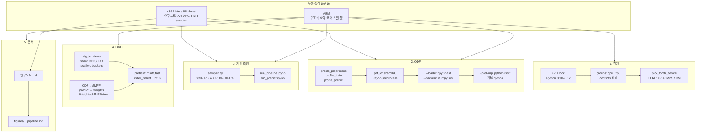
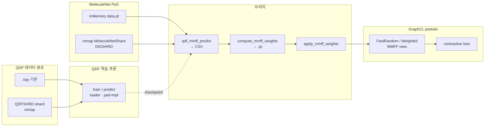

# 3DGCL 레포 작업 종합 요약 (플랫폼·스택·파이프라인)

이 문서는 **레포 분리 이후 3DGCL에서 진행한 작업**을 두 축으로 묶습니다.

1. **대화에서 정리한 한국어 요약** — QDF 쪽은 CPU·IO·전처리, DGCL 쪽은 벤치·브리지·pretrain 호스트 병목 제거 중심.
2. **구조화된 기술 목록(섹션 1–5)** — 환경·QDF·자원 측정·DGCL·문서를 코드 경로 단위로 정리한 버전.

사용자 확인에 따르면, **아래 구조화 목록을 바탕으로 한 정리·실행은 ARM 환경에서 수행된 기록**에 해당합니다. 반면 `연구노트.md`에는 **Intel Arc XPU·Windows PDH 카운터** 등 **x86 / Windows** 실측이 함께 적혀 있으므로, **수치·OS별 세부(예: PDH)는 플랫폼을 읽고 해석**해야 합니다.

---

## 플랫폼·근거 한눈에

| 구분 | 내용 |
|------|------|
| **ARM (사용자 기준)** | 구조화 요약에 대응하는 작업 범위(환경 분리, QDF Rust/shard, sampler·노트북, DGCL `dig_io`/MMFF·pretrain 벡터화, 문서화 방향)를 **ARM에서 정리·실행**했다고 가정할 때의 기준점. 코어 수 스윕·Linux 예시 노트북(`python_vs_rust_per_core.ipynb` 등)은 **멀티코어 스케일링 검증**에 해당. |
| **x86 / Intel / Windows (`연구노트.md`)** | Arc 140V + `torch+xpu`, `bench/sampler.py`의 **PDH(Process V2, GPU Engine)**, shard vs npy 학습 비교 등 **해당 OS·하드웨어에 묶인 실측**. |

동일한 **설계·코드 경로**는 플랫폼을 바꿔도 재사용 가능하고, **절대 시간·CPU%/XPU% 스케일**은 기기마다 달라집니다.

---

## 1. 환경·도구

- **uv** + `pyproject.toml` / `uv.lock`: Python **3.10–3.12**, 기본 그룹은 **CPU PyTorch** 스택.
- **dependency-groups**: `cpu` / `xpu` 분리, `tool.uv.conflicts`로 상호 배제.
- **`dig.sslgraph.utils.pick_torch_device`**: CUDA / XPU / MPS / DirectML 등 디바이스 선택 정리, README에 `uv sync` 동기화 명령 정리.

---

## 2. QDF (`QuantumDeepField_molecule/`) — 프로파일링과 Rust

| 영역 | 내용 |
|------|------|
| **프로파일** | `bench/profile_preprocess.py`, `profile_train.py`, `profile_predict.py` — 전처리 단계, 학습(`fwd`/`bwd`/`step`/`io`), 추론 분해; XPU면 동기화·warmup 옵션. |
| **`qdf_io`** | PyO3 + maturin: mmap **ShardReader**, Rayon **`preprocess_batch_rust`**, 선택적 LCAO 호스트 헬퍼, **ShardWriter**. |
| **데이터** | `.npy` 대신 **QDFSHRD** 단일 shard — `dataset_shard.py`, `convert_to_shard.py`, `verify_shard.py`; 학습·벤치는 `--loader {npy,shard}`. |
| **전처리** | `--backend {numpy,rust}`, `--output-format {npy,shard,both}`; Rust 경로는 기하 연산을 다코어로 단축(노트 기준 **파싱·저장 제외** 시 대략 **~22×** 급, 환경 의존). |
| **학습·추론** | `train.py` / `predict.py`: `--loader`, `--pad-impl {python,rust,rust-pad-only}`; `model_patches`는 **인스턴스만** 패치해 원본 클래스 유지. |
| **LCAO Rust 패치** | 수치 동치 확인되나, 기록된 **Arc + XPU + 일부 배치**에서는 총합 악화 → **스위치·코드는 유지, 기본값은 Python**. |

---

## 3. “CPU별”·자원 측정

- **`bench/sampler.py`**: 서브프로세스 실행 시 wall, RSS, **CPU%**, **XPU%** 샘플링. Windows는 **PDH**(Process V2, GPU 엔진); 그 외는 psutil 등으로 **0–100% 시스템 비율**에 맞춤.
- **노트북**: `run_pipeline.ipynb`(전처리·학습 조합 + 시각화), `run_predict.ipynb`(추론만), 그림은 `bench/figs/`.
- **코어 수 스윕(예: Linux / ARM 관심)**: `profile_preprocess`를 코어 1→N으로 돌려 **Python vs Rust** 스케일링·메모리 곡선을 그리는 노트북 경로(예: `test/examples/sslgraph/bench/python_vs_rust_per_core.ipynb`) — 저장소 루트에 없을 수 있으니 **실제 경로는 로컬 브랜치·실험 폴더**를 따름.

즉 **“CPU별 학습”**이라기보다, **CPU 코어 수·백엔드별 전처리/호스트 병목**과 **학습 중 CPU↔가속기(XPU/CUDA 등) 역할**을 수치·그래프로 나눈 쪽에 가깝습니다.

---

## 4. DGCL (`dig/` + `dig_io/`) — 그래프 SSL

| 영역 | 내용 |
|------|------|
| **`dig_io`** | QDF와 비슷한 스택으로 대조 **뷰 커널**(Uniform / RW / EdgePerturb 등), `key_split` / `scaffold_split`의 **Rust 버킷 정렬**, MoleculeNet용 **DIGSHRD** shard(mmap → PyG `Data`). 미빌드 시 stub + `is_available()`. |
| **파인튜닝** | `loader='pt' \| 'shard'`, shard 없으면 **pt 폴백**. |
| **Pretrain 병목** | 실측상 PyG `to_data_list` / `from_data_list` 비중이 커서, **Rust 대신** `mmff_fast.py` **벡터화(`index_select`)** + bf16 등으로 대응; Rust 뷰 fn은 **마이크로벤치**에서는 여전히 이득. |
| **QDF–MMFF 브리지** | `qdf_mmff_predict.py`, `compute_mmff_weights.py`, `WeightedMMFFView`, 보조 타깃 `build_qdf_aux_ensemble.py` 등. |

문서·도식: 레포에는 `figures/qdf_dgcl_integration_pipeline.md`(Mermaid 원본)와 `연구노트.md`가 가장 완전합니다. 사용자가 언급한 `docs/qdf_to_dgcl_pipeline*.md`, `docs/dig_io_shard_and_kernels.md`는 **동일 주제를 `docs/`에 두고 싶을 때의 목표 경로**로 두고, 현재 트리에 없으면 이 파일을 **인덱스**로 삼으면 됩니다.

---

## 5. 문서·정리물

| 자료 | 역할 |
|------|------|
| **`연구노트.md`** | 측정 수치, 설계 결정, 다음 할 일까지 **일지 수준으로 가장 완전**. |
| **`figures/qdf_dgcl_integration_pipeline.md`** | QDF → 브리지 → 가중치 → GraphCL 논문용 **Mermaid** 소스. |
| **`docs/3dgcl_work_summary_platforms.md`** (본 문서) | 플랫폼 주의 + 위 목록 **한 장 요약**. |

---

## 한 줄 요약

이 레포에서는 **QDF 전처리·IO·호스트 LCAO를 프로파일 → Rust/shard로 완화(옵션)**하고, **DGCL은 `dig_io` + shard 로더 + 뷰/스캐폴드 Rust 옵션**과 **MMFF/QDF 브리지·pretrain 호스트 병목 제거(벡터화 MMFF 등)**를 하며, 그걸 **sampler·노트북·(ARM에서의) 코어별 벤치**로 수치화해 둔 상태입니다. 더 깊은 근거는 **`연구노트.md` 한 파일**이 중심입니다.

---

## 다이어그램 A — 작업 스윔레인과 플랫폼

---

## 다이어그램 B — 데이터·학습 연결 (요약)

QDF와 DGCL 사이의 **데이터·가중치·사전학습**만 따로 보면 아래와 같습니다. (상세 Mermaid는 `figures/qdf_dgcl_integration_pipeline.md` 참고.)

---

## 렌더링

Mermaid는 [Mermaid Live Editor](https://mermaid.live)나 VS Code 확장, `mmdc`로 PNG/SVG/PDF로보낼 수 있습니다.
