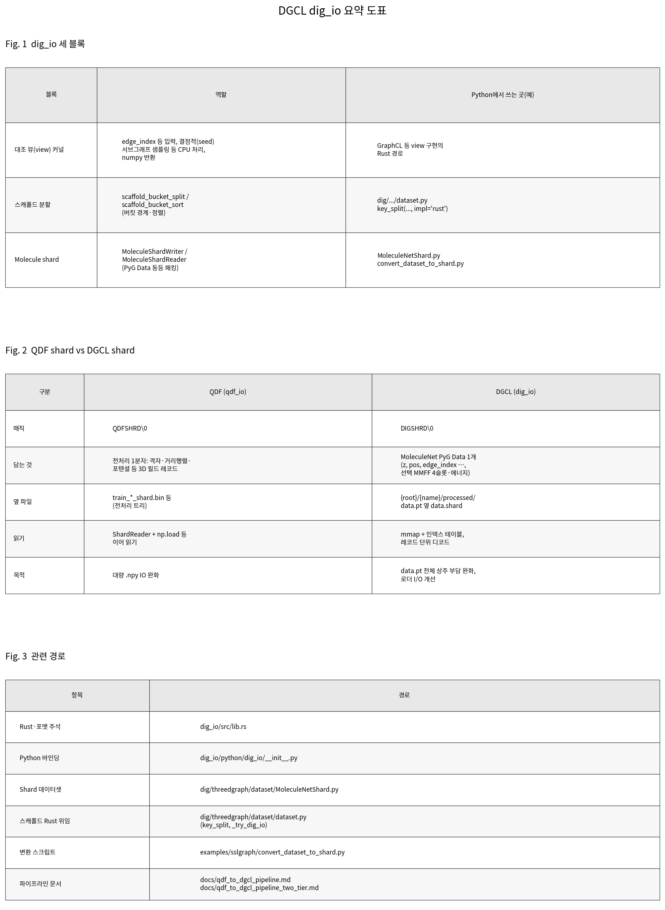

# Figure: `dig_io` · shard 요약 (SVG / PNG)

설명·맥락은 [`dig_io_shard_and_kernels.md`](../dig_io_shard_and_kernels.md)를 보세요.

## 이미지

| 형식 | 파일 |
|------|------|
| SVG (확대 선명) | [`dig_io_shard_figure.svg`](dig_io_shard_figure.svg) |
| PNG (슬라이드·문서 삽입) | [`dig_io_shard_figure.png`](dig_io_shard_figure.png) |



## 다시 그리기

한글 표는 **Noto Sans CJK** 계열이 있어야 깨지지 않습니다 (예: Debian `fonts-noto-cjk`).

```bash
.venv/bin/python docs/figures/render_dig_io_shard_figures.py
```
