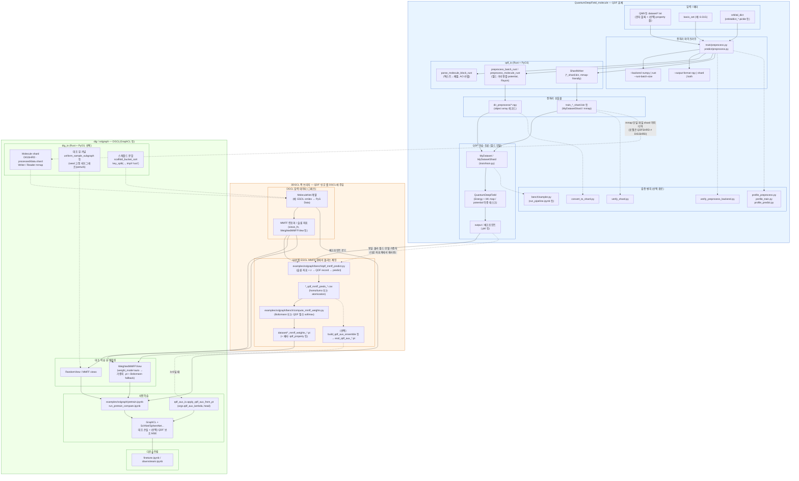
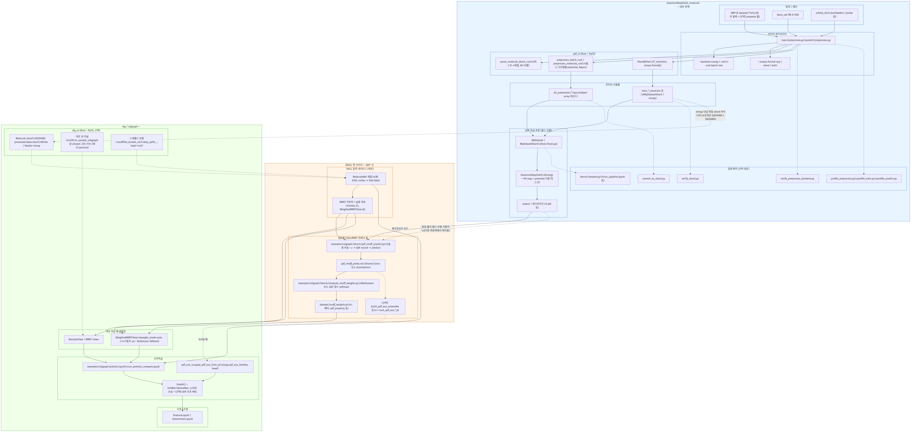

# QDF → DGCL 연결 프로세스 (3DGCL 레포)

이 문서는 **QuantumDeepField(QDF)** 와 **DGCL(dig/sslgraph, GraphCL 등)** 사이의 데이터·코드 흐름을 한 장에 정리한 도표입니다.  
(채팅에서 공유한 Mermaid와 동일 내용을 파일로 보관합니다.)

## 요약

| 구간 | 내용 |
|------|------|
| **QDF** | `*.txt` → `preprocess.py` + `qdf_io` → `.npy` / `*_shard.bin` → `train.py` → **체크포인트** |
| **브리지** | ESOL 등 **MMFF 슬롯 좌표**에서 **QDF 추론** → CSV → **가중치 `.pt`** (선택: **aux `.pt`**) |
| **DGCL** | MoleculeNet + 대조 뷰 + **(선택) `dig_io` Rust** (Molecule shard mmap, 뷰 커널, 스캐폴드 정렬) → **GraphCL 사전학습** → 파인튜닝/다운스트림 |

> QDF **전처리 산출물**과 DGCL **PyG 그래프**는 포맷이 다릅니다. 실질적인 연결은 **학습된 QDF 체크포인트를 MMFF 좌표 위에서 다시 호출**하는 스크립트 체인입니다.

## 도표 (Mermaid)

GitHub·VS Code 등 Mermaid를 렌더하는 뷰어에서 열면 그림으로 보입니다. **PNG/SVG 정적 산출물**은 [`figures/mermaid/`](figures/mermaid/) 및 [`mermaid/README.md`](figures/mermaid/README.md) 참고.

### 렌더된 이미지 (Mermaid 미지원 뷰어·인쇄용)

`docs/figures/render_mermaid_diagrams.py`로 재생성합니다.

| PNG | SVG |
|-----|-----|
| [figures/mermaid/qdf_to_dgcl_pipeline.png](figures/mermaid/qdf_to_dgcl_pipeline.png) | [figures/mermaid/qdf_to_dgcl_pipeline.svg](figures/mermaid/qdf_to_dgcl_pipeline.svg) |

## DGCL 쪽 Rust (`dig_io`) — shard·뷰·스캐폴드

QDF의 **`qdf_io`** 가 전처리·`QDFSHRD` shard를 다루는 것과 달리, DGCL용 **`dig_io`** 는 **PyG 그래프 파이프라인**을 위한 선택적 네이티브 확장입니다. 빌드: 레포 루트에서 `cd dig_io && maturin develop --release` 등. Python에서는 `dig_io.is_available()` 이 참일 때만 Rust 경로를 쓰고, 실패 시 순수 Python으로 동작합니다.

### 1) Molecule shard (`DIGSHRD`, `data.shard`)

- **역할:** MoleculeNet이 만든 `Data`와 동등한 텐서·메타를 **한 파일**에 패킹하고 **`mmap`** 으로 `__getitem__` 시점에 읽습니다. `processed/data.pt` 전체를 메모리에 올리는 부담을 줄이거나 I/O 패턴을 단순화할 때 쓰는 **옵션**입니다.
- **위치:** 보통 `{root}/{dataset}/processed/data.pt` 옆의 **`data.shard`**.
- **코드:** `dig_io.MoleculeShardWriter` / `MoleculeShardReader`, Python 쪽 `dig.threedgraph.dataset.MoleculeNetShard`, 변환 `examples/sslgraph/convert_dataset_to_shard.py` (또는 `MoleculeNetShard` 내 변환). 파인튜닝 등에서 **`loader='shard'`** 를 고르면 이 경로를 탑니다.
- **QDF shard와 혼동 주의:** QDF 전처리의 `*_shard.bin` 은 매직 **`QDFSHRD`** 이고 필드 레코드용입니다. DGCL `data.shard` 는 **`DIGSHRD`** 로 **그래프(`z`, `pos`, `edge_index`, …, 선택 MMFF 슬롯)** 용입니다. 이름만 비슷하고 포맷·소비 코드는 완전히 다릅니다.

### 2) 대조 뷰(view) 커널

- **역할:** `edge_index` 등을 넣고 **시드가 고정된** 서브그래프 샘플링·랜덤 워크·엣지 perturb 등을 CPU에서 처리해 numpy로 돌려줍니다. GraphCL 계열에서 뷰 생성 비용을 줄일 때 쓰입니다.
- **연결:** 도표상 `dig_io` 뷰 커널은 **`RandomView` / MMFF 뷰** 쪽 사전학습(`pretrain.ipynb` 등)으로 이어지는 **가속 경로**로 보면 됩니다.

### 3) 스캐폴드 분할 (`scaffold_bucket_sort`)

- **역할:** `dig.threedgraph.dataset.dataset.key_split` 에서 **`impl='rust'`** 일 때, 키(예: 스캐폴드 id) 기준 **안정 정렬·버킷 경계 반올림**을 Rust에 맡깁니다. 동일 RNG 시드면 기존 Torch 구현과 맞추는 것이 목표입니다.
- **연결:** 도표의 `MoleculeNet` 노드는 **데이터셋 구축·split** 단계와 맞물리므로 점선으로 연결했습니다.

### 더 읽기

- 상세 스펙·표: [`dig_io_shard_and_kernels.md`](dig_io_shard_and_kernels.md), 도표만 [`figures/dig_io_shard_figure.png`](figures/dig_io_shard_figure.png) / [`.svg`](figures/dig_io_shard_figure.svg)

## 관련 문서·색인

- 레포 색인: `notebooks_overview.md`
- 연구 노트(구현 디테일): `연구노트.md`

## 파일 위치

- 본 문서: `docs/qdf_to_dgcl_pipeline.md`
