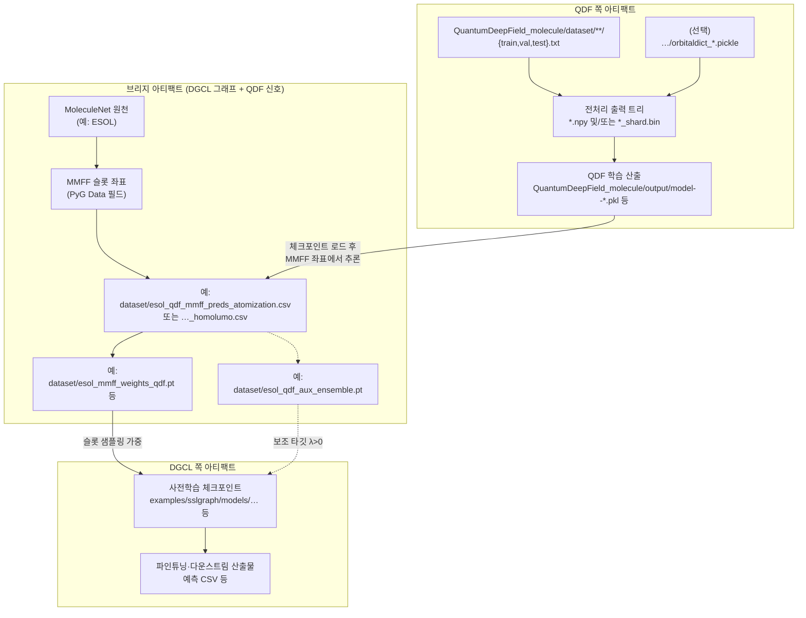
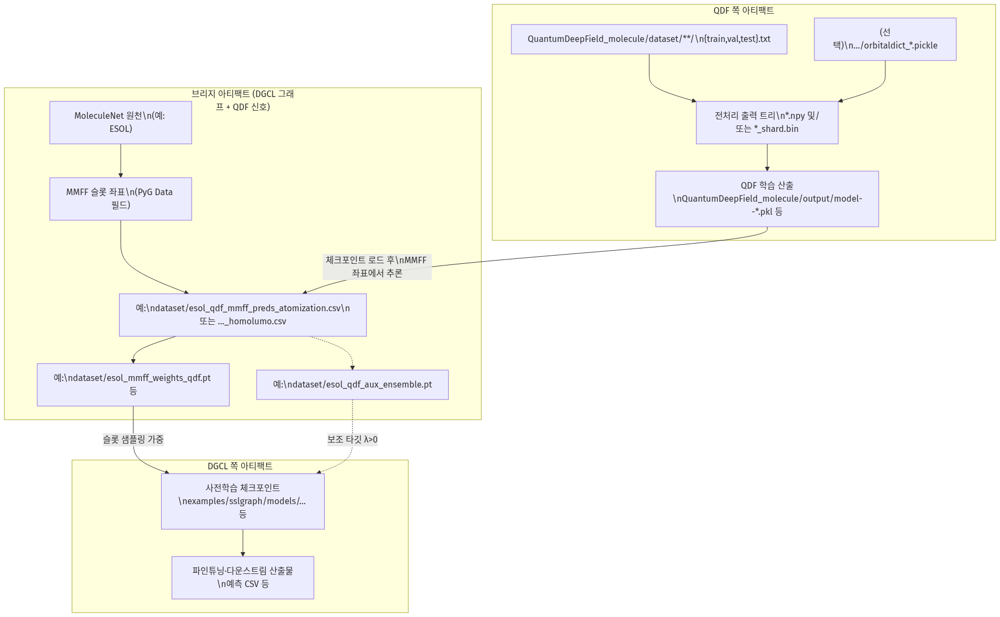
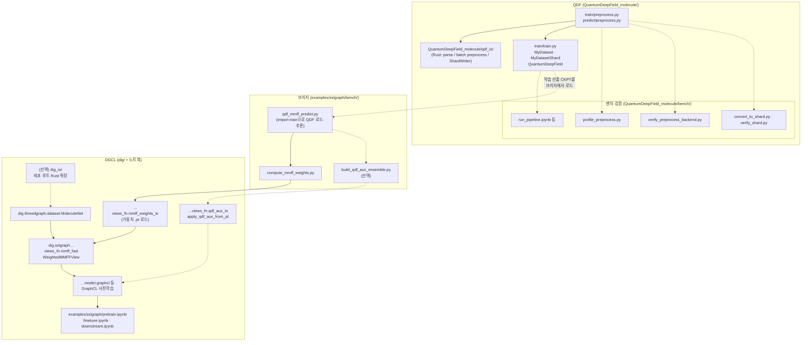
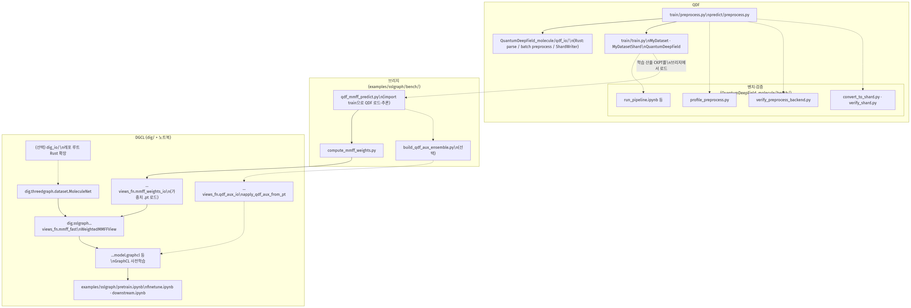

# QDF → DGCL 연결 — 상·하 2단 도표 (3DGCL)

**경로·파일명은 현재 레포 트리 기준(2026-05)** 입니다. 스크립트나 디렉터리 이름이 바뀌면 이 문서의 표·도표를 같이 고쳐야 합니다.

- **상단:** 데이터·파일·산출물 **데이터 평면**
- **하단:** 그걸 읽고 쓰는 **코드·모듈 평면**  
  (모든 경로는 **레포 루트 `3DGCL/`** 에서의 상대 경로.)

통합 한 장 도표: `docs/qdf_to_dgcl_pipeline.md`

**렌더 산출물:** 아래 각 절 Mermaid와 동일 내용의 PNG/SVG는 `docs/figures/mermaid/` 에 있습니다. 갱신(레포 루트): `.venv/bin/python docs/figures/render_mermaid_diagrams.py`

---

## [상] 데이터·산출물 평면

| PNG | SVG |
|-----|-----|
| [figures/mermaid/qdf_to_dgcl_two_tier_data.png](figures/mermaid/qdf_to_dgcl_two_tier_data.png) | [figures/mermaid/qdf_to_dgcl_two_tier_data.svg](figures/mermaid/qdf_to_dgcl_two_tier_data.svg) |

---

## [하] 코드·모듈 평면

| PNG | SVG |
|-----|-----|
| [figures/mermaid/qdf_to_dgcl_two_tier_code.png](figures/mermaid/qdf_to_dgcl_two_tier_code.png) | [figures/mermaid/qdf_to_dgcl_two_tier_code.svg](figures/mermaid/qdf_to_dgcl_two_tier_code.svg) |

상단 **D4**(체크포인트 파일)와의 대응은 아래 표를 기준으로 보시면 됩니다.

---

## 상↔하 대응표 (레포 기준, 검수됨)

| 상단 (무엇이 흐르나) | 하단 (누가 다루나) |
|----------------------|---------------------|
| `QuantumDeepField_molecule/dataset/**/{train,val,test}.txt` + (선택) `orbitaldict_*.pickle` | `QuantumDeepField_molecule/train/preprocess.py`, `predict/preprocess.py` + `QuantumDeepField_molecule/qdf_io` |
| 전처리 트리의 `*.npy` / `*_shard.bin` | 위 `preprocess.py`의 `create_dataset(..., output_format=...)`; 로더는 `train/train.py`의 `MyDataset` / `MyDatasetShard` |
| `QuantumDeepField_molecule/output/model--*.pkl` (QDF 학습 결과) | `QuantumDeepField_molecule/train/train.py`가 생성; 브리지 추론 시 `examples/sslgraph/bench/qdf_mmff_predict.py`가 `QuantumDeepField_molecule/train`을 `sys.path`에 올려 `import train`으로 로드 |
| ESOL 등 MoleculeNet + MMFF 필드 | `dig.threedgraph.dataset.MoleculeNet`; 뷰는 `dig.sslgraph.method.contrastive.views_fn.mmff_fast` 등 |
| `dataset/esol_qdf_mmff_preds_atomization.csv` 또는 `..._homolumo.csv` | `examples/sslgraph/bench/qdf_mmff_predict.py` (`--qdf-property`) |
| `dataset/esol_mmff_weights_qdf*.pt` 등 | `examples/sslgraph/bench/compute_mmff_weights.py` → 가중치 소비: `dig.sslgraph.method.contrastive.views_fn.mmff_weights_io` + `WeightedMMFFView` |
| `dataset/esol_qdf_aux_ensemble.pt` 등 | `examples/sslgraph/bench/build_qdf_aux_ensemble.py` → `dig.sslgraph.method.contrastive.views_fn.qdf_aux_io.apply_qdf_aux_from_pt` |
| 사전학습·다운스트림 산출물 | 주로 `examples/sslgraph/pretrain.ipynb`, `examples/sslgraph/bench/run_pretrain_compare.ipynb` → `examples/sslgraph/finetune.ipynb`, `downstream.ipynb` |
| (선택) DGCL 측 Rust 가속 | 레포 루트 `dig_io/` 패키지 — 노트북 예: `examples/sslgraph/bench/run_dgcl_rust.ipynb` |

### 이전 표에서 고친 점

1. **`bench/...` 단독 경로** → 실제 QDF 벤치는 **`QuantumDeepField_molecule/bench/`** 아래.  
2. **`build_qdf_aux_*.py`** → 실제 파일명은 **`build_qdf_aux_ensemble.py`**.  
3. **`qdf_aux_io` 단독** → 전체 모듈 **`dig.sslgraph.method.contrastive.views_fn.qdf_aux_io`**.  
4. **`WeightedMMFFView`만** → 가중치 `.pt`는 **`mmff_weights_io`** 와 짝을 이룸.  
5. **`model--*.pkl` → train.py에서 torch.load** 로만 적으면 오해 소지 → **학습은 `train.py`**, **MMFF 추론은 `qdf_mmff_predict.py`** 로 분리 기술.

---

## 파일 위치

- 본 문서: `docs/qdf_to_dgcl_pipeline_two_tier.md`
- 단일 통합 도표: `docs/qdf_to_dgcl_pipeline.md`
