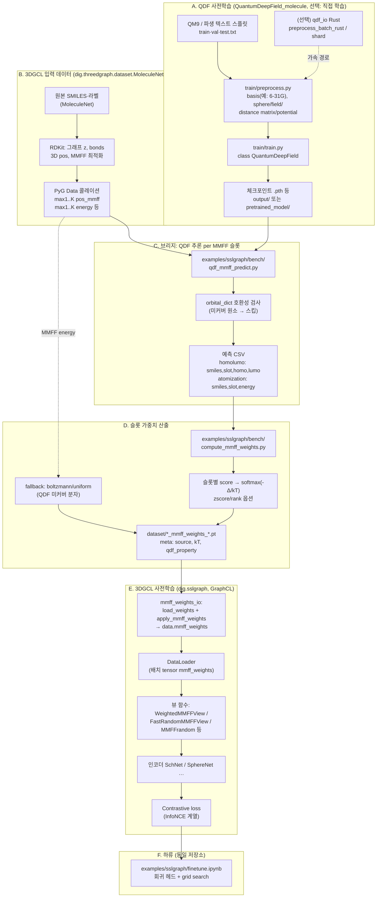
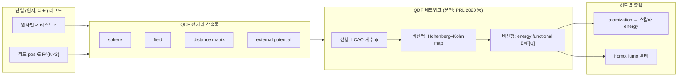
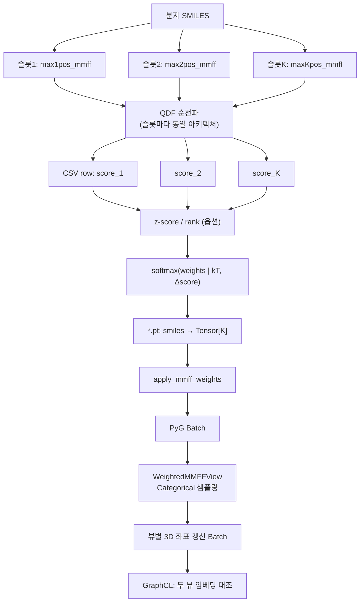
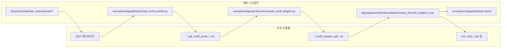

# QDF → 3DGCL(DGCL) 통합 파이프라인 (논문용 도식 원본)

이 문서는 저장소 내 **Quantum Deep Field (QDF)** 스택과 **3D Graph Contrastive Learning (3DGCL, DIG `sslgraph`)** 사이의 데이터·모델·학습 연결을 한 장에 담기 어려울 정도로 세분화한 **Mermaid** 소스입니다. 렌더링은 [Mermaid Live Editor](https://mermaid.live), VS Code Mermaid 확장, 또는 `mermaid-cli`(`npm i -g @mermaid-js/mermaid-cli` → `mmdc -i fig.mmd -o fig.pdf`)로 수행하면 논문 삽입용 PDF/SVG를 얻을 수 있습니다.

---

## Figure caption (English, for manuscript)

**Figure — End-to-end integration from quantum deep fields to 3D graph contrastive learning.**  
QM9-style *ab initio* labels pre-train a QDF model (LCAO wavefunction ansatz, Hohenberg–Kohn map, and energy functional). For each molecule in a MoleculeNet benchmark, RDKit-MMFF conformer slabs (`max{1…K}pos_mmff`, energies) are already stored in the PyG dataset. A bridge script runs the **same** QDF preprocessing helpers (`create_sphere`, `create_field`, `create_distancematrix`, `create_potential`) on every MMFF slot and evaluates `QuantumDeepField` to produce a per-(SMILES, slot) CSV. Slot scores are turned into a Boltzmann-like categorical distribution (`compute_mmff_weights.py`, optional z-score normalization, Boltzmann fallback for uncovered species). Weights are attached in-place to `Data.mmff_weights` (`apply_mmff_weights`). During GraphCL pre-training, `WeightedMMFFView` (or related MMFF views) samples conformers according to that distribution, coupling learned quantum-chemical priors to 3D contrastive representation learning. Optional Rust extensions (`qdf_io`, `dig_io`) accelerate preprocessing and graph views respectively.

---

## 그림 설명 (한국어 캡션 초안)

**그림 — 양자 심층장(QDF)에서 3차원 그래프 대조학습(3DGCL)으로 이어지는 통합 파이프라인.**  
QM9 등의 양자화학 라벨로 QDF를 사전학습하면, 분자의 LCAO 기반 파동함수와 DFT 제약을 반영한 에너지·궤도 예측기를 얻는다. MoleculeNet 계열 PyG 데이터는 RDKit MMFF로 생성된 다중 슬롯 좌표·에너지를 이미 보유한다. 브리지 스크립트는 각 슬롯 좌표에 대해 QDF 전처리를 수행한 뒤 사전학습 가중치로 순전파 추론하여 CSV에 (SMILES, 슬롯, 물성)을 기록한다. `compute_mmff_weights.py`는 이를 슬롯별 softmax 가중치로 변환하고(정규화·`kT`·스코어 식), 궤도 사전이 커버하지 못하는 원소는 MMFF 에너지 Boltzmann으로 보완할 수 있다. 가중치는 `mmff_weights`로 그래프에 부착되고, GraphCL 단계의 `WeightedMMFFView` 등이 이 분포에 따라 3D 뷰를 샘플링하여 대조 손실과 연결된다. 선택적으로 `qdf_io`·`dig_io`가 전처리·뷰 연산을 가속한다.

---

## Diagram A — 전체 스윔레인 (오프라인 QDF · 브리지 · 3DGCL)



---

## Diagram B — QDF 내부 데이터텐서 (개념)



---

## Diagram C — MMFF 슬롯 ↔ QDF ↔ 가중치 ↔ 대조 뷰 (세부)



---

## Diagram D — 아티팩트·스크립트 대응표 (저장소 경로)



---

## 논문 본문에 넣을 때 체크리스트

| 항목 | 내용 |
|------|------|
| **물성 선택** | `atomization`(MMFF 슬롯 간 분산이 큼, ESOL 등에 권장) vs `homolumo`(슬롯 간 거의 퇴화 가능 → z-score 필수) |
| **커버리지** | QDF `orbital_dict`가 H/C/N/O/F 위주 QM9 체크포인트일 때 할로젠·P/S 등은 추론 스킵 → Boltzmann 폴백 |
| **물리 단위** | MMFF 에너지 vs QDF 출력 eV 스케일; 가중치는 상대 스코어 기반 softmax |
| **재현성** | `kT`, `normalize`, `score_expr`, 체크포인트 경로를 `.pt` meta에 기록 |
| **가속** | `qdf_io`(QDF 전처리), `dig_io`(서브그래프·뷰), `FastRandomMMFFView` / 환경변수 경로 |

---

## 단일 파일로보내기 (예시)

아래 블록만 별도 `qdf_dgcl_A.mmd`로 저장한 뒤 `mmdc`로 PDF/SVG 변환할 수 있습니다.

```bash
# 예: Diagram A만 추출해 SVG 생성 (mermaid-cli 설치 가정)
mmdc -i qdf_dgcl_A.mmd -o qdf_dgcl_A.svg -b transparent
```

---

*Generated for repository 3DGCL / DIG sslgraph + bundled QuantumDeepField_molecule. Paths are relative to repository root.*
