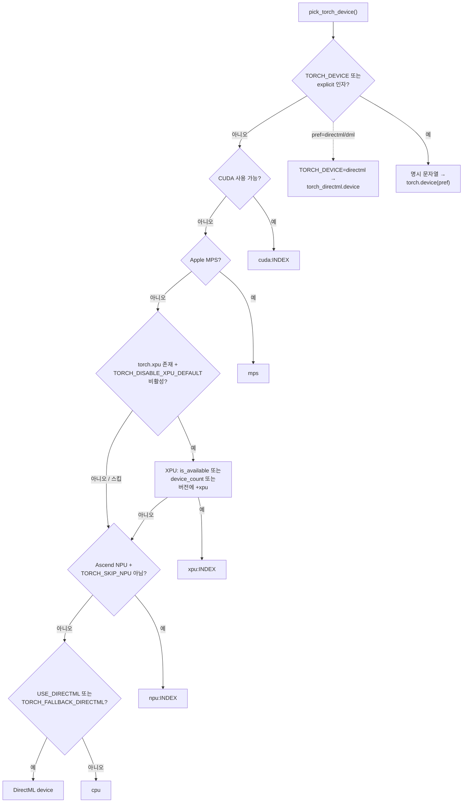
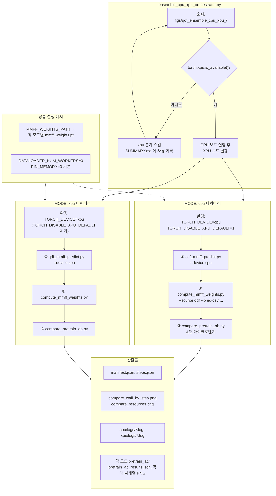
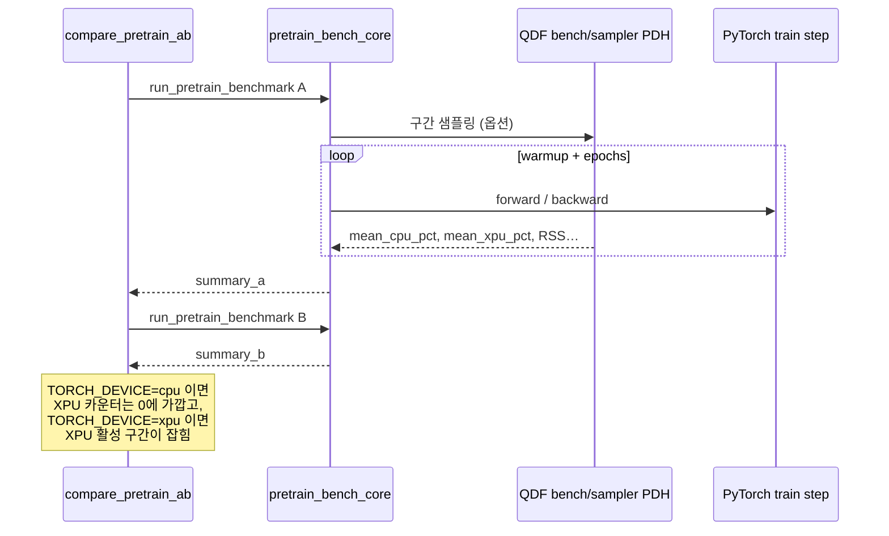

# CPU vs XPU 파이프라인 (3DGCL / QDF 벤치)

이 저장소에서 **Intel XPU(`torch.xpu`)** 와 **CPU** 를 분리해 측정하는 흐름을 정리했습니다. 오케스트레이터는 `examples/sslgraph/bench/ensemble_cpu_xpu_orchestrator.py`, 디바이스 선택은 `dig/sslgraph/utils/device.py` 의 `pick_torch_device()` 입니다.

---

## 1. 디바이스 선택 (`pick_torch_device`) — 일반 학습/평가

`TORCH_DEVICE` 가 비어 있으면 아래 **우선순위**로 첫 매칭 디바이스를 고릅니다. `TORCH_DEVICE=cpu` 또는 `xpu:0` 처럼 지정하면 그대로 사용합니다.



---

## 2. 앙상블 오케스트레이터 — **동일 파이프라인**을 CPU / XPU 로 각각 1회

`ensemble_cpu_xpu_orchestrator.py` 는 **한 런 디렉터리** 아래에 `cpu/` 와 `xpu/` 를 만들고, 환경만 바꿔 **같은 3단계**를 순차 실행합니다. XPU 런타임이 없으면 XPU 분기는 스킵됩니다.



---

## 3. `compare_pretrain_ab.py` — 리소스 샘플링 (CPU % / XPU %)

사전학습 마이크로벤치 실행 중 **wall time**, **CPU·XPU 사용률**(가능 시 Windows PDH + QDF `bench/sampler.py`), **RSS** 등을 JSON/그림으로 남깁니다. A/B(또는 C) 구성은 `isolated_env()` 로 환경만 바꿔 **비파괴** 비교합니다.



---

## PNG 로보내기

- **권장:** [Mermaid Live](https://mermaid.live) 에서 위 블록을 붙여넣어 PNG/SVG 저장.
- **CLI:** `figures/xpu_cpu_orchestrator.mmd` 를 `@mermaid-js/mermaid-cli` 로 변환:

```text
npx --yes @mermaid-js/mermaid-cli -i figures/xpu_cpu_orchestrator.mmd -o figures/xpu_cpu_orchestrator.png -b white
```

오케스트레이터 요약도는 **`figures/xpu_cpu_orchestrator.png`** 로도 저장해 두었습니다(아래 `mmdc` 명령으로 재생성 가능).
